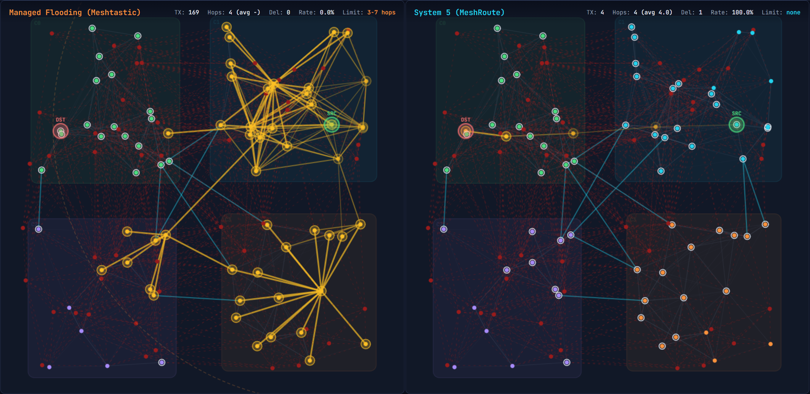

# MeshRoute

**A geo-clustered multi-path routing proposal for Meshtastic — benchmarked against Meshtastic's actual managed flooding (v2.6/2.7).**

**[Live Demo](https://clemenssimon.github.io/MeshRoute/)** — Interactive presentation with algorithm visualizations, simulation results, and resilience testing.

**[Live Simulator](https://clemenssimon.github.io/MeshRoute/simulator.html)** — Step-by-step side-by-side comparison of Managed Flooding vs System 5.

## Live Simulator



*Left: Managed Flooding (Meshtastic) — 169 TX to flood 4 hops, every node rebroadcasts blindly. Right: System 5 (MeshRoute) — 4 TX along a direct path through cluster bridge nodes. Same network, same message, same hop count.*

The simulator lets you:
- **Step hop-by-hop** through both routing algorithms simultaneously
- **See the difference visually** — yellow highlights show message spread, green shows the delivery path
- **Click nodes** to choose source and destination
- **Switch 18 scenarios** — from small local mesh to disaster relief, including mixed-mode backward compatibility
- **Read explanations** of what happens at each hop and why System 5 knows the right path
- **Compare mixed-mode** — see how S5 nodes coexist with legacy Meshtastic nodes (10%–90% S5 ratios)

## Meshtastic's Current Routing (v2.6/2.7)

Meshtastic does **not** use naive flooding. Its actual routing is already quite clever:

- **Managed Flooding** (all messages): Before rebroadcasting, nodes listen briefly. If they hear another node rebroadcast first, they suppress. SNR-based priority gives distant nodes shorter contention windows so they rebroadcast first. ROUTER/ROUTER_LATE roles always rebroadcast. This suppresses ~40-50% of transmissions vs. naive flooding.
- **Next-Hop Routing** (direct messages since v2.6): First message floods. The system learns which relay succeeded. Subsequent DMs go only via that cached relay node. Falls back to managed flooding if the next-hop fails.
- **Congestion Scaling** (v2.6+): Networks with 40+ nodes automatically stretch broadcast intervals using `ScaledInterval = Interval * (1 + (Nodes - 40) * 0.075)`.

**The limitation:** Both approaches still scale as O(n) per message. The hop limit (3-7) remains necessary because each hop multiplies transmissions proportional to network size.

## What System 5 Proposes

A routing protocol that achieves **O(hops) cost** instead of O(n) — for all message types, not just DMs.

**Geo-Clustering** — Nodes self-organize by GPS geohash. Full topology within clusters, border nodes between.

**Multi-Path Routing** — Up to 5 cached paths per destination. Instant failover with 3 retries per hop.

**Weighted Load Balancing** — `W(r) = α·Q(r) + β·(1-Load(r)) + γ·Batt(r)`. Traffic distributed proportionally across paths.

**Adaptive QoS** — Network Health Score per cluster throttles low-priority traffic under stress. SOS always gets through.

**Scoped Fallback** — When all routes fail: flood only SRC + DST clusters + border neighbors (not full network).

**Backward Compatible** — S5 nodes coexist with legacy Meshtastic nodes. S5 nodes route directed between each other, flood normally for legacy compatibility. Legacy nodes prefer S5 neighbors when flooding.

## The Key Difference: ~1 TX per Hop

| Approach | Cost per Message | Cost per Hop | Hop Limit Needed? |
|----------|:----------------:|:------------:|:-----------------:|
| Managed Flooding | O(n) * (1-S) | n * (1-S) | Yes (3-7) |
| Next-Hop (DMs) | O(hops) after learning | ~1 | Partially |
| **System 5** | **O(hops) always** | **~1** | **No** |

This makes the hop limit irrelevant: 20 hops cost less than managed flooding costs for 1.

## Simulation Results (26 Scenarios, 6 Routers)

The simulator compares all four approaches on identical networks (100 messages each). Results with improved System 5 (multi-path + scoped fallback):

### Scale Tests

| Scenario | Nodes | Managed Flood TX | System 5 TX | S5 Del% | S5 vs Managed |
|----------|------:|-----------------:|------------:|--------:|--------------:|
| Small Local (1km) | 20 | 16,459 | 115 | 100% | **99.3% less** |
| Medium City (5km) | 100 | 201,920 | 5,678 | 100% | **97.2% less** |
| Large Regional (20km) | 500 | 1,002,437 | 624,539 | 76% | **37.7% less** |
| Dense Urban (3km) | 200 | 1,490,555 | 241,715 | 100% | **83.8% less** |
| 1000 Nodes (40km) | 1000 | 548,710 | 535,352 | 45% | 2.4% less |
| 1500 Nodes (50km) | 1500 | 563,607 | 634,546 | **51%** | *S5 delivers more* |

### Realistic Environments

| Scenario | Managed TX | System 5 TX | S5 Del% | S5 vs Managed |
|----------|----------:|------------:|--------:|--------------:|
| Rural Long Range | 30,152 | 287 | 100% | **99.0% less** |
| Hiking Trail (linear) | 28,894 | 215 | 100% | **99.3% less** |
| Maritime / Coastal | 9,319 | 339 | 100% | **96.4% less** |
| Festival / Event | 912,953 | 107 | 100% | **99.99% less** |
| Building Emergency | 3,651,559 | 386 | 100% | **99.99% less** |
| Highway Convoy | 52,072 | 189 | 100% | **99.6% less** |
| Community Mesh | 75,991 | 88 | 100% | **99.9% less** |
| Indoor-Outdoor Mix | 268,468 | 3,405 | 100% | **98.7% less** |

### Stress Tests

| Scenario | Managed TX | System 5 TX | S5 Del% | Managed Del% | S5 vs Managed |
|----------|----------:|------------:|--------:|--------:|--------------:|
| 30% Degraded Links | 208,164 | 21,342 | 73% | 100% | **89.7% less** |
| 50% Degraded Links | 215,372 | 19,231 | 73% | 100% | **91.1% less** |
| 20% Nodes Killed | 132,780 | 5,292 | 80% | 100% | **96.0% less** |
| Combined Stress | 170,094 | 15,423 | 80% | 100% | **90.9% less** |
| Disaster Relief | 35,635 | 252 | 78% | 90% | **99.3% less** |
| Mountain Valley | 747 | 1,245 | 5% | 3% | *both fail* |
| Partition Recovery | 62,773 | 26,874 | 56% | 88% | **57.2% less** |
| Duty Cycle Stress | 404,779 | 18,168 | 100% | 100% | **95.5% less** |

### Bay Area Real-World Topology (NEW — with half-duplex radio model)

Based on feedback from Bay Area Mesh operators: 3-tier elevation topology (mountain/hill/valley) with **half-duplex radio constraint** (nodes can't TX while receiving). This models the real collision cascade problem at mountaintop routers.

**[Detailed analysis and Q&A](docs/bay-area-feedback-response.md)** | **[Try the Bay Area scenario in the Live Simulator](https://clemenssimon.github.io/MeshRoute/simulator.html)**

| Scenario | Managed TX | S5 TX | Managed Del% | S5 Del% | Key Insight |
|----------|----------:|------:|:-----------:|:------:|------------|
| Bay Area (no half-duplex) | ~909K | ~47K | ~87% | ~80% | S5 saves **~95% TX** |
| **Bay Area (half-duplex)** | **~7K** | **~516K** | **~6%** | **~74%** | **Half-duplex destroys flooding** |
| Bay Area + Stress | ~6K | ~283K | ~5% | ~55% | S5 delivers **~11× more** |
| **Bay Area + Silencing** | **~7K** | **~284K** | **~6%** | **~70%** | **TX halved, 57% nodes muted** |
| Bay Area + Silencing + Stress | ~6K | ~132K | ~5% | ~49% | Silencing + stress combined |

*Results averaged over 5 random seeds for statistical reliability.*

**Node Silencing** (NEW): Redundant nodes are identified and muted — they still listen but don't rebroadcast. 128 of 193 valley nodes are silenced, reducing System 5 TX by ~45% with only ~4% less delivery. Mountain nodes (critical backbone) are never silenced. Battery-fair rotation every 10 minutes ensures even drain.

The half-duplex constraint collapses managed flooding from 87.5% → 6% delivery (mountaintop routers are stuck in RX from 10+ simultaneous rebroadcasts). System 5's directed routing holds at 77.5% because it sends only along the computed path — the mountaintop node receives one packet, forwards to the next hop, done.

### Key Findings

- **Dense/medium networks**: System 5 saves **83-99.99%** of transmissions with 100% delivery
- **Stress conditions**: Still saves 57-99% TX, delivery 73-80% (scoped fallback flooding helps)
- **Metro Scale (1500 nodes)**: S5 delivers **51% vs Managed's 36%** — S5 is actually better at large scale!
- **Bay Area (half-duplex)**: System 5 delivers **~74% vs Flooding's ~6%** — directed routing survives the mountaintop collision cascade that destroys flooding
- **Extreme conditions** (mountain, partition): Both systems struggle. System 5's fallback keeps it competitive.
- **Node Silencing**: Muting 57% of redundant nodes halves TX cost with minimal delivery loss
- **Backward compatibility**: Mixed-mode works — S5 nodes ignore hop limit (they don't flood), prefer S5 neighbors

## ESP32 Firmware Prototype

Working standalone firmware for three LoRa boards — no Meshtastic fork needed. **[Installation Guide](firmware/README.md)** | **[Virtual Network Test Results](https://clemenssimon.github.io/MeshRoute/docs/esp-test-results.html)**

```
firmware/
  platformio.ini              — Build: pio run -e heltec_v3 / tbeam / rak4631
  include/
    board_config.h            — Pin definitions (Heltec V3, T-Beam, RAK4631)
    system5.h                 — Routing core API (14 functions)
    lora_hal.h                — LoRa abstraction (RadioLib SX1276/SX1262)
    gps_hal.h                 — GPS + RSSI triangulation + cluster inheritance
    wire_protocol.h           — Over-the-air packet format (22-byte header)
  src/
    main.cpp                  — Full application (OGM, routing, display, serial CLI)
    system5.c                 — Routing logic (geohash, multi-path, QoS, fallback)
    lora_hal.cpp              — RadioLib wrapper for both radio chips
    gps_hal.cpp               — GPS with 3 fallback levels for boards without GPS
    wire_protocol.c           — Packet serialize/deserialize with static_assert
  test/
    test_system5.c            — 11 unit tests
```

### Supported Boards

| Board | MCU | Radio | GPS | Display | Build Target |
|-------|-----|-------|-----|---------|-------------|
| Heltec V3 | ESP32-S3 | SX1262 | No (triangulation) | OLED 0.96" | `heltec_v3` |
| T-Beam v1.1 | ESP32 | SX1276 | NEO-6M | OLED 0.96" | `tbeam` |
| RAK4631 | nRF52840 | SX1262 | RAK1910 module | No | `rak4631` |

### Features

- **OGM neighbor discovery** every 30s (position, battery, cluster)
- **System 5 directed routing** with managed flooding fallback
- **3 position sources**: Real GPS → RSSI triangulation (3+ neighbors) → cluster inheritance
- **OLED status display** (node ID, cluster, NHS, neighbors, stats)
- **Serial CLI**: `send <hex_id> <message>`, `status`, `pos <lat> <lon>`
- **Watchdog** (30s, auto-reboot on hang)
- **~8KB RAM** for routing state (100 nodes)

### Build

```bash
# Install PlatformIO, then:
pio run -e heltec_v3   # Heltec WiFi LoRa 32 V3
pio run -e tbeam       # TTGO T-Beam v1.1
pio run -e rak4631     # RAK WisBlock 4631
pio run -e native      # Unit tests on PC
```

## Interactive Presentation

Open `index.html` in a browser. No build step, no dependencies.

- **Four algorithm animations** on identical topology: Naive Flooding, Managed Flooding (Meshtastic current), Next-Hop (v2.6), System 5
- **Simulation results** with interactive charts and log/linear toggle
- **Step-by-step formation animation**
- **Three scale scenarios** — local, continental, global
- **Interactive resilience testing** — click nodes to kill them
- **QoS priority gate** with real-time NHS gauge

## Running the Python Simulator

```bash
cd simulator
python run.py                          # run all 26 scenarios (6 routers each)
python run.py --scenario 2             # single scenario
python run.py --parallel scenarios     # parallel across all CPU cores
python run.py --visualize              # ASCII network topology
```

### Scenarios (26 total)

| Category | Scenarios |
|----------|-----------|
| **Scale** | Small Local (20), Medium City (100), Large Regional (500), Dense Urban (200), 1000 Nodes, 1500 Nodes |
| **Stress** | 30% / 50% degraded links, 20% node failure, combined stress, duty cycle |
| **Terrain** | Rural Long Range (SF12), Hiking Trail (linear), Mountain Valley, Maritime (line of sight) |
| **Mobile** | Festival/Event (dense + mobile), Building Emergency (indoor), Highway Convoy |
| **Realistic** | Community Mesh (stable), Indoor-Outdoor Mix, Disaster Relief, Partition Recovery |
| **Bay Area** | Bay Area Mesh (3-tier, half-duplex), Bay Area + Stress, Bay Area + Silencing, Bay Area + Silencing + Stress |

### Simulator Architecture

```
simulator/
  run.py          — CLI entry point (parallel execution support)
  meshsim.py      — Network simulation (nodes, links, clusters, routes, mobility)
  routing.py      — NaiveFloodingRouter, ManagedFloodingRouter,
                    NextHopRouter, System5Router
  lora_model.py   — EU 868MHz LoRa model (terrain, duty cycle, collisions)
  geohash.py      — Geographic clustering via geohash
  benchmark.py    — 22 scenarios, 4 routers, multiprocessing benchmark
```

## Architecture Origins

| Source | Concept | Used As |
|--------|---------|---------|
| Internet (OSPF) | Area-based hierarchy | Geo-clusters with border nodes |
| Freifunk (B.A.T.M.A.N.) | OGM counting | Link quality metric |
| Data Centers (ECMP) | Weighted multi-path | Proportional load distribution |
| Network Theory | Back-pressure | Congestion avoidance |
| Ant Colony Optimization | Pheromone decay | Self-optimizing route weights |
| DNS | Hierarchical cache | Scoped node discovery |

## Project Status

- [x] Algorithm design and mathematical analysis
- [x] Interactive presentation with live visualizations
- [x] Python simulator (4 routers, 22 scenarios, EU868 LoRa model)
- [x] Fair comparison against Meshtastic v2.6/2.7 actual routing
- [x] Interactive live simulator with hop-by-hop stepping
- [x] Mixed-mode backward compatibility simulation (S5 + Legacy)
- [x] ESP32 firmware prototype (Heltec V3, T-Beam, RAK4631)
- [x] Node Silencing — battery-fair muting of redundant nodes
- [x] Half-duplex radio modeling in simulator
- [x] Bay Area 3-tier topology simulation
- [x] Sequence numbers in wire protocol (gap detection)
- [x] Detailed "How It Works" technical walkthrough page
- [ ] Field testing with real LoRa hardware
- [ ] RFC / proposal to Meshtastic community

## License

MIT — see [LICENSE](LICENSE)

## Author

[Clemens Simon](https://github.com/ClemensSimon)
